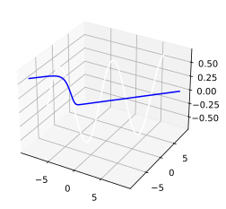
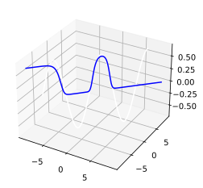
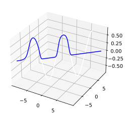

```python
import numpy as np
import pandas as pd
import matplotlib.pyplot as plt

```


```python
# 二维训练集样本
x = np.array((np.linspace(-7, 7, 200), np.linspace(-7, 7, 200))).T
y = np.expand_dims((np.cos(x[:, 0]) + np.sin(x[:, 1])) * 0.5, 1)
bp = BackPropagation(q=3, lr_1=0.5, lr_2=0.6)
bp.fit(x, y, max_iter=1000, error=0.0001, same_error_times=10)

```

    iterated 1000/1000 times, error is 19.441564975483463, covergent 1 times.


```python
ax = plt.subplot(111, projection="3d")
ax.plot3D(x[:, 0], x[:, 1], y[:, 0], c="w")
ax.plot3D(x_test[:, 0], x_test[:, 1], Y_Y[:, 0], c="b")


```


    [<mpl_toolkits.mplot3d.art3d.Line3D at 0x7fb286c26340>]





```python
# 二维训练集样本
x = np.array((np.linspace(-7, 7, 200), np.linspace(-7, 7, 200))).T
y = np.expand_dims((np.cos(x[:, 0]) + np.sin(x[:, 1])) * 0.5, 1)
bp = BackPropagation(q=5, lr_1=0.8, lr_2=0.6)
bp.fit(x, y, max_iter=1000, error=0.0001, same_error_times=10)

```

    iterated 568/1000 times, error is 14.466125682677891, covergent 9 times.


```python
# 二维测试集样本
x_test = np.array((np.linspace(-9, 9, 200), np.linspace(-9, 9, 200))).T
Y_Y = bp.predict(x_test)

```


```python
ax = plt.subplot(111, projection="3d")
ax.plot3D(x[:, 0], x[:, 1], y[:, 0], c="w")
ax.plot3D(x_test[:, 0], x_test[:, 1], Y_Y[:, 0], c="b")


```


    [<mpl_toolkits.mplot3d.art3d.Line3D at 0x7fb286b2af70>]





```python
start_time = time.time()
bp.fit(
    x,
    y,
    max_iter=1000000,
    error=0.00001,
    same_error_times=200,
    Rh=bp.Rh,
    Thej=bp.Thej,
    Vih=bp.Vih,
    Whj=bp.Whj,
)
end_time = time.time()
print("training costs {} s".format(end_time - start_time))

```

    iterated 21841/1000000 times, error is 13.866926271017798, covergent 199 times.
    training costs 573.6911239624023 s


```python
# 二维测试集样本
x_test = np.array((np.linspace(-9, 9, 200), np.linspace(-9, 9, 200))).T
Y_Y = bp.predict(x_test)

```


```python
ax = plt.subplot(111, projection="3d")
ax.plot3D(x[:, 0], x[:, 1], y[:, 0], c="w")
ax.plot3D(x_test[:, 0], x_test[:, 1], Y_Y[:, 0], c="b")


```


    [<mpl_toolkits.mplot3d.art3d.Line3D at 0x7fb28699fcd0>]




